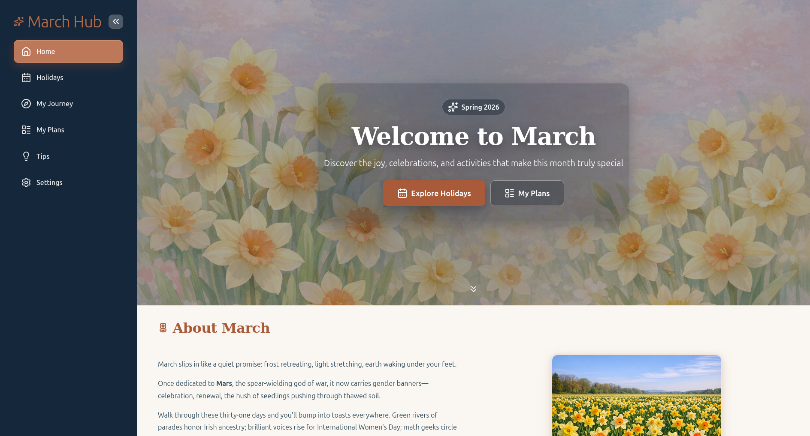
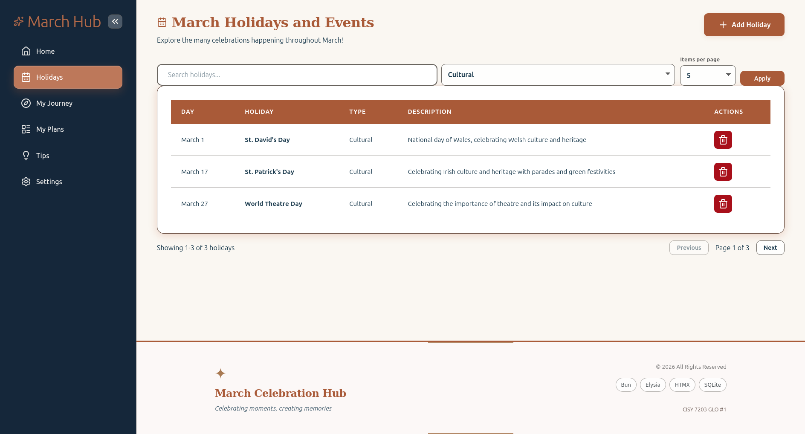
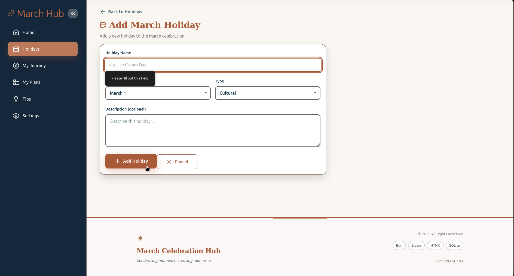
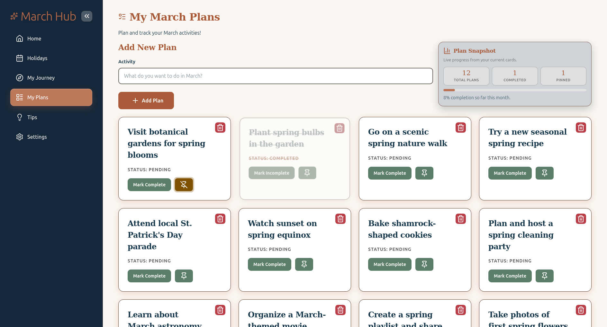
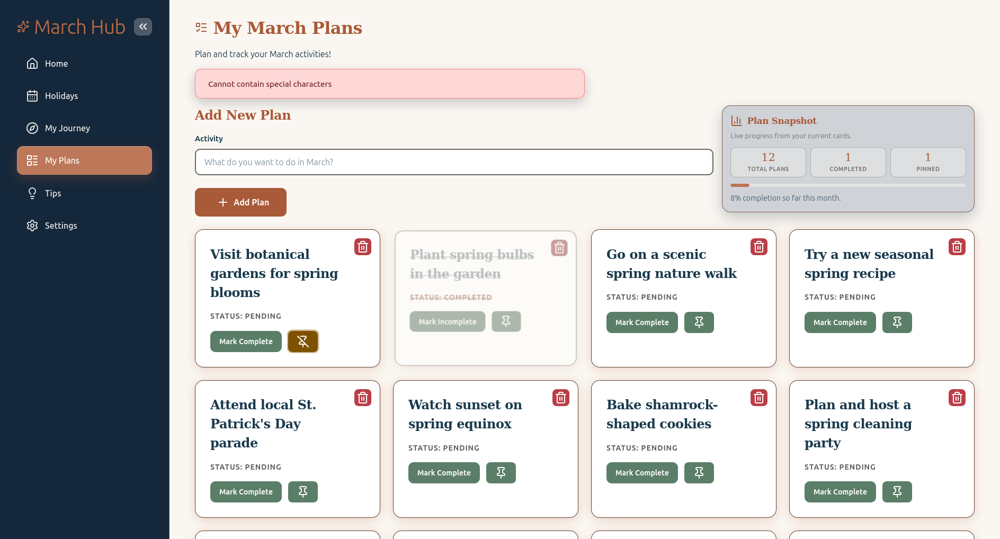
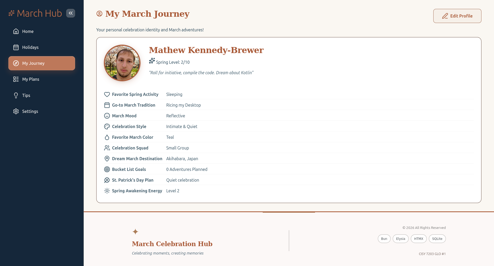
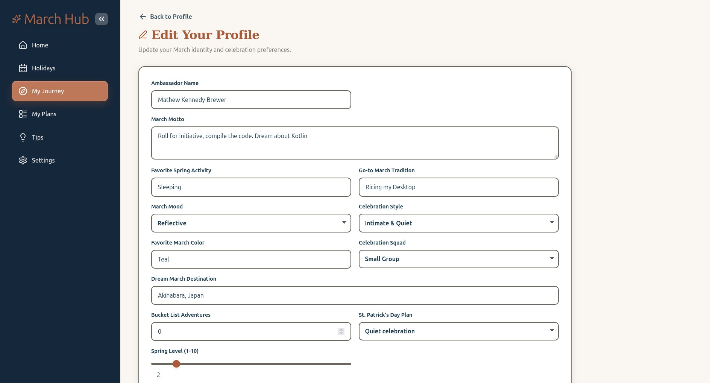
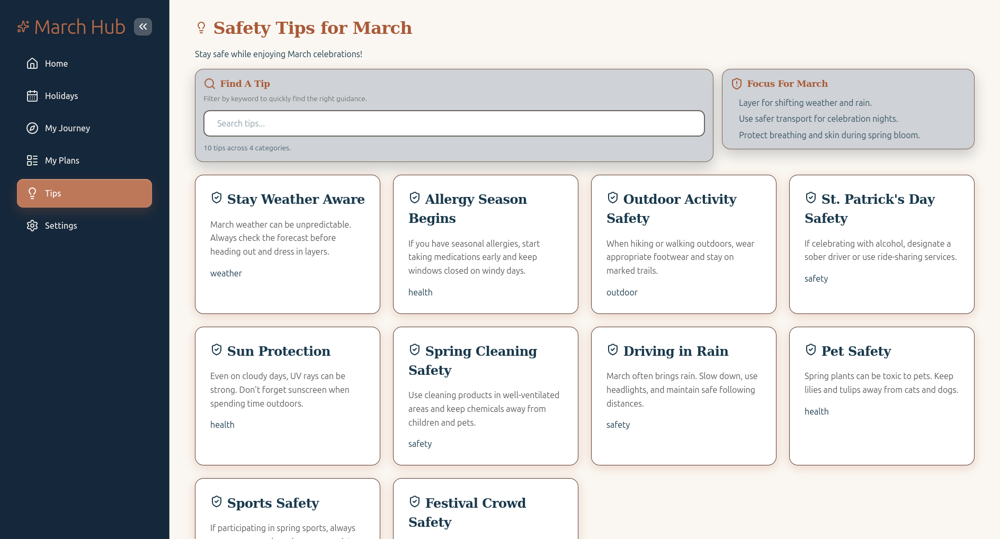
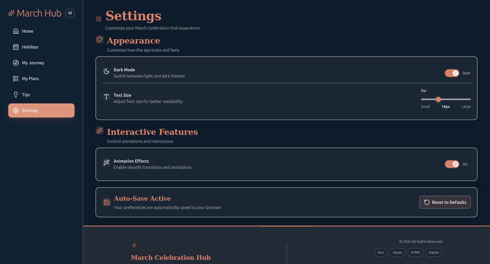

# March Celebration Hub

March Celebration Hub is a Bun + Elysia + HTMX app built for CISY 7203 GLO #1.
It includes a themed multi-page experience for March holidays, personal plans, safety tips, profile customization, and settings.

## Stack

- TypeScript
- Bun
- Elysia
- SQLite (`bun:sqlite`)
- HTMX
- Lucide icons
- localForage (preference persistence)

## Current Features

### Home
- Hero section with spring wallpaper
- Navigation into all feature areas
- Quote, goals, and intro cards

### Holidays
- Data-backed holidays table (seeded with 12 records)
- Search and type filtering
- Pagination with URL sync (`hx-push-url`)
- Adjustable `itemsPerPage` control on-page
- Add holiday page with client + server validation
- Delete holiday with confirm flow and URL success toast

### My Journey (Profile)
- Profile display card
- Dedicated edit page (`/profile/edit`)
- URL-based success/error messaging
- Server-side validation via use-cases/schemas

### My Plans
- Add, delete, complete/incomplete, pin/unpin
- Live "Plan Snapshot" stats panel (total/completed/pinned/rate)
- Error feedback toast area with auto-dismiss

### Tips
- Data-backed tips cards (seeded with 10 records)
- Search/filter interactions
- Focus panel for seasonal guidance

### Settings
- Theme toggle (light/dark)
- Text size slider (applies on release)
- Animation toggle
- Preference reset
- Preferences persisted with localForage + cookie bootstrap for first paint

### Shared UX
- Toast auto-dismiss centralized in `client.js`
- Sidebar collapse/expand with persisted state
- Mobile-friendly responsive layout
- Error pages present and styled

## Screenshots











## Assignment Coverage (CISY_7203_GLO_1_S26.md)

- Strict site structure with navigation and index entry page
- HTML structure usage (tables, headings, forms, semantic sections)
- Images + text-rich content pages
- CSS coverage including inline/internal/external styles
- JavaScript interactive processing (validation, input management, UI state changes)
- Data binding for profile, holidays, plans, and safety tips
- At least 10 records in bound datasets
- Responsive and accessibility-oriented design practices

## Project Structure

```text
src/
  config/
  controllers/
  db/
  domain/ports/
  repositories/
  routes/
  schemas/
  server/
  services/
  static/
    css/
    js/
      client.js
      pages/
        add-holiday-page.js
        holidays-page.js
        plans-page.js
        settings-page.js
  templates/
    components/
    pages/
  types/
  use-cases/
  utils/
```

## Scripts

```bash
bun run dev       # run server
bun run check     # typecheck + lint
bun run typecheck
bun run lint
bun run lint:fix
bun run format
bun run docs
bun run docs:serve
```

## Database Seed Counts

- `holidays`: 12
- `tips`: 10
- `plans`: 12
- `profile`: 1

## Notes for Contributors

- Keep template files mostly declarative; page behavior should live in `src/static/js/pages/`.
- Keep page styles in `src/static/css/pages/` and import through `src/static/css/main.css`.
- Prefer URL state for filters/pagination where it improves shareability and consistency.

- **Repository Pattern**: Data access abstraction
- **Dependency Injection**: Loose coupling between components
- **MVC Architecture**: Clear separation of concerns
- **Server-Side Rendering**: JSX templates rendered on the server
- **Hypermedia-Driven UI**: HTMX for dynamic interactions

---

## 🎨 Design System

### Color Palette

#### Light Mode
| Color | Hex | Usage |
|-------|-----|-------|
| Primary (Terracotta) | `#A95A38` | Buttons, accents |
| Secondary (Sage) | `#5B7E68` | Secondary buttons |
| Background | `#FAF7F2` | Page background |
| Nav Background | `#1A3A4D` | Sidebar |
| Gold | `#FFD700` | Highlights |

#### Dark Mode
| Color | Hex | Usage |
|-------|-----|-------|
| Primary | `#D98068` | Buttons, accents |
| Background | `#0D1B2A` | Page background |
| Nav Background | `#08151D` | Sidebar |
| Card Background | `#1A2633` | Cards |

### Typography

- **Headings**: Playfair Display (serif)
- **Body**: DM Sans (sans-serif)
- **Code**: DejaVu Sans Mono

---

## 🌐 API Endpoints

### Holidays

| Method | Endpoint | Description |
|--------|----------|-------------|
| GET | `/holidays` | List all holidays |
| POST | `/holidays` | Create new holiday |
| PUT | `/holidays/:id` | Update holiday |
| DELETE | `/holidays/:id` | Delete holiday |

### Plans

| Method | Endpoint | Description |
|--------|----------|-------------|
| GET | `/plans` | List all plans |
| POST | `/plans` | Create new plan |
| PUT | `/plans/:id/toggle` | Toggle completion |
| DELETE | `/plans/:id` | Delete plan |

### Profile

| Method | Endpoint | Description |
|--------|----------|-------------|
| GET | `/profile` | Get user profile |
| PUT | `/profile` | Update profile |

### Tips

| Method | Endpoint | Description |
|--------|----------|-------------|
| GET | `/tips` | List all tips |

---

## 🔒 Accessibility

This application follows **WCAG 2.1 AA** guidelines:

- ✅ Semantic HTML structure
- ✅ ARIA labels for interactive elements
- ✅ Keyboard navigation support
- ✅ High contrast color ratios
- ✅ Screen reader compatible
- ✅ Responsive design for all devices
- ✅ Focus indicators for all interactive elements

---

## 📝 Data Seeded

### March Holidays (12 records)

| Holiday | Date | Type |
|---------|------|------|
| St. David's Day | March 1 | Cultural |
| International Women's Day | March 8 | Global |
| Pi Day | March 14 | Fun |
| St. Patrick's Day | March 17 | Cultural |
| First Day of Spring | March 19 | Astronomical |
| World Forestry Day | March 21 | Environmental |
| World Water Day | March 22 | Environmental |
| International Day for Elimination of Racial Discrimination | March 21 | Global |
| National Cookie Day | March 24 | Fun |
| National Single Parent Day | March 26 | Awareness |
| World Theatre Day | March 27 | Cultural |
| Easter Sunday | March 31 | Religious |

### Safety Tips (10 records)

Categories: Weather, Health, Outdoor, Safety

---

## 🤝 Contributing

Contributions are welcome! Please feel free to submit a Pull Request.

1. Fork the repository
2. Create your feature branch (`git checkout -b feature/AmazingFeature`)
3. Commit your changes (`git commit -m 'Add some AmazingFeature'`)
4. Push to the branch (`git push origin feature/AmazingFeature`)
5. Open a Pull Request

---

## 📄 License

This project is licensed under the MIT License - see the [LICENSE](LICENSE) file for details.

Copyright (c) 2026 Mathew Kennedy-Brewer

Permission is hereby granted, free of charge, to any person obtaining a copy
of this software and associated documentation files (the "Software"), to deal
in the Software without restriction, including without limitation the rights
to use, copy, modify, merge, publish, distribute, sublicense, and/or sell
copies of the Software, and to permit persons to whom the Software is
furnished to do so, subject to the following conditions:

The above copyright notice and this permission notice shall be included in all
copies or substantial portions of the Software.

THE SOFTWARE IS PROVIDED "AS IS", WITHOUT WARRANTY OF ANY KIND, EXPRESS OR
IMPLIED, INCLUDING BUT NOT LIMITED TO THE WARRANTIES OF MERCHANTABILITY,
FITNESS FOR A PARTICULAR PURPOSE AND NONINFRINGEMENT. IN NO EVENT SHALL THE
AUTHORS OR COPYRIGHT HOLDERS BE LIABLE FOR ANY CLAIM, DAMAGES OR OTHER
LIABILITY, WHETHER IN AN ACTION OF CONTRACT, TORT OR OTHERWISE, ARISING FROM,
OUT OF OR IN CONNECTION WITH THE SOFTWARE OR THE USE OR OTHER DEALINGS IN THE
SOFTWARE.

---

## 👤 Author

**Mathew Kennedy-Brewer** ([@Mystery2099](https://github.com/Mystery2099))

---

<div align="center">

**Made with ❤️ for CISY 7203 - Web Programming 2**

</div>
